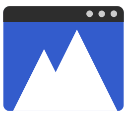

# Nordi

 



An unofficial GTK linux application to interact with the [NordVPN](https://nordvpn.com/) binary, written in C.

## Features

The focus of the app is to somewhat mimic the user experience on the Windows version of NordVPN, however this app is just a graphical interface that interacts with the binary, thus it **needs** NordVPN to be installed to be usable.

- [x] Log in/out to NordVPN
- [x] Quick connecting/disconnecting
- [x] Temporary disconnecting with auto reconnecting
- [x] Connecting to a specific country/group
- [ ] Configure settings like firewall, threat protection, DNS, etc
- [ ] Enable/disable meshnet
- [ ] List other devices on meshnet
- [ ] File sharing
- [ ] Tray version for quick actions (similar to Windows app)
- [ ] Desktop notifications on connect/disconnect (similar to Windows app)
- [ ] Support locales

## Installing

Nordi requires [NordVPN](https://support.nordvpn.com/Connectivity/Linux/1325531132/Installing-and-using-NordVPN-on-Debian-Ubuntu-Raspberry-Pi-Elementary-OS-and-Linux-Mint.htm) to be installed.

- Using the pre built Debian package

```sh
sudo dpkg -i nordi.deb
```

- Alternatively you can build from source, by cloning this repo and running the installer on the root of the project:

```sh
make && sudo make install
```

## Compiling

Dependencies:

- [libgtk-4-dev](https://www.gtk.org/docs/installations/linux/)
- [blueprint-compiler](https://gitlab.gnome.org/jwestman/blueprint-compiler)
- [str](https://github.com/maxim2266/str) (included as a submodule)

Optional dependencies:

- [clang-tidy](https://clang.llvm.org/extra/clang-tidy/)
- [bear](https://github.com/rizsotto/Bear)

All dependencies can be installed with APT by running `sudo make setup`.

On the root of the project just run `make` OR `make build` command and the app will be built to the `build/` directory. To produce a debug binary use `make build-debug` instead.

## Testing

Nordi uses the [µnit](https://nemequ.github.io/munit/#about) test framework for unit tests, which is included as a submodule.

The tests can be build and ran by calling `make test`.

## Contributing


## License

Copyright 2023 Ayzurus

Permission is hereby granted, free of charge, to any person obtaining a copy of this software and associated documentation files (the “Software”), to deal in the Software without restriction, including without limitation the rights to use, copy, modify, merge, publish, distribute, sublicense, and/or sell copies of the Software, and to permit persons to whom the Software is furnished to do so, subject to the following conditions:

The above copyright notice and this permission notice shall be included in all copies or substantial portions of the Software.

THE SOFTWARE IS PROVIDED “AS IS”, WITHOUT WARRANTY OF ANY KIND, EXPRESS OR IMPLIED, INCLUDING BUT NOT LIMITED TO THE WARRANTIES OF MERCHANTABILITY, FITNESS FOR A PARTICULAR PURPOSE AND NONINFRINGEMENT. IN NO EVENT SHALL THE AUTHORS OR COPYRIGHT HOLDERS BE LIABLE FOR ANY CLAIM, DAMAGES OR OTHER LIABILITY, WHETHER IN AN ACTION OF CONTRACT, TORT OR OTHERWISE, ARISING FROM, OUT OF OR IN CONNECTION WITH THE SOFTWARE OR THE USE OR OTHER DEALINGS IN THE SOFTWARE.
